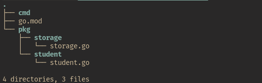

Цель задания

Научиться декомпозировать и рефакторить код на примере программы, написанной в прошлом уроке.

Что нужно сделать

В прошлом домашнем задании вы написали программу для работы со студентами. Мы указываем в стандартный ввод данные о студенте, а после получения сигнала об окончании работы программы она выводит имена всех студентов на экран.

Вам нужно отрефакторить код прошлого домашнего задания. Декомпозируйте его так, чтобы логике одной сущности соответствовал один пакет.

Для того, чтобы вы могли использовать методы и переменные, которые объявлены в других пакетах, сделайте их экспортируемыми.

Структура программы после рефакторинга может выглядеть следующим образом:
